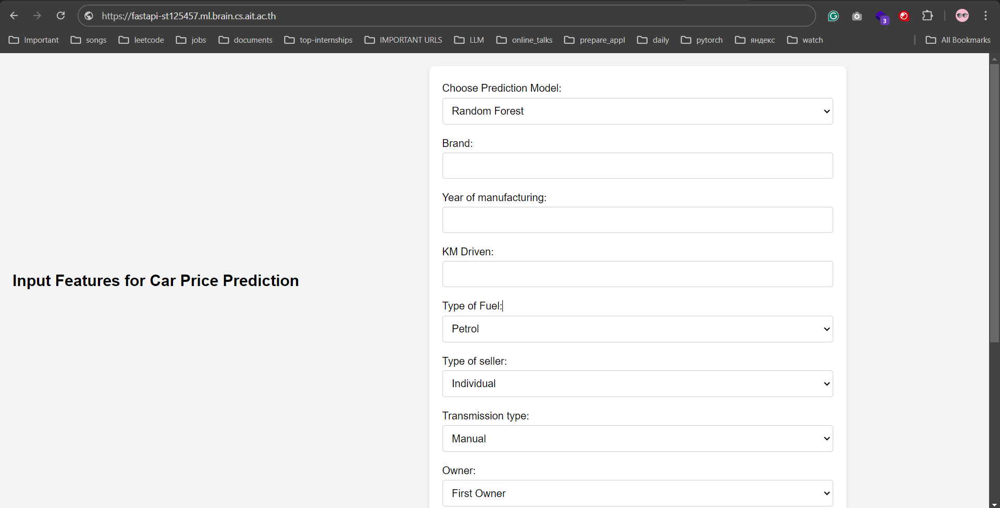

# Asian Institute of Technology - Assignment 2 - Car Prediction

## Overview
In this assignment, we implemented class based model of LinearRegression with several features including momentum, xavier initialization, feature importance analysis. We also integrated MLflow into our code, and analyzed how it is actually easier to log your model performance, and see some graphs based on history of training inside the mlflow experiment. We also deployed our model using docker hub and traefik in actual server, and now our model is accessible for the entire world.

The access for the running web platform is (https://fastapi-st125457.ml.brain.cs.ait.ac.th/)[https://fastapi-st125457.ml.brain.cs.ait.ac.th/]

## What was implemented
We extended our jupyter notebook developed in the first assignment, added classful implementation of LinearRegression, different features, implemented our custom cross validation for custom model, also implemented PolynomialRegression. The task was more focused on applying modern tools, and studying them took some time.

## Server part
While integrating the custom model into fast-api environment, I have faced issues with unpickling the model. It took some time to come up with solution as storing model weights (which I think is real-case scenario), and loading them inside fast-api startup handling. I decided to not duplicate the html document so that each model will have its own page, but rather I prefered to let user choose inside the form. I think this logic is fine.

